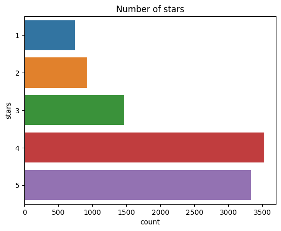

# Using Natural Language Processing to Analyze Yelp Reviews

Yelp provides a crowd-sourced review forum for businesses and services. People share their reviews and rate businesses and services. Other users can also rate other people's reviews.

The goal of this project is to build a machine learning model that can predict whether customers are satisfied or not based on the reviews they have written.

My personal learning objective from this project is to explore the basics of Natural Language Processing (NLP), apply feature extraction using Count Vectorizers and understand the theory behind Naive Bayes classifiers.

## Exploratory Data Analysis

**Summary Statistics**

|           | **stars** | **cool** | **useful** | **funny** |
|----------:|----------:|---------:|-----------:|----------:|
| **count** |     10000 |    10000 |      10000 |     10000 |
|  **mean** |      3.78 |     0.88 |       1.41 |      0.70 |
|  **std**  |      1.21 |     2.08 |       2.34 |      1.91 |
|  **min**  |         1 |        0 |          0 |         0 |
|  **25%**  |         3 |        0 |          0 |         0 |
|  **50%**  |         4 |        0 |          1 |         0 |
|  **75%**  |         5 |        1 |          2 |         1 |
|  **max**  |         5 |       77 |         76 |        57 |

**Observations**
- The dataset contains 10000 reviews and 10 features.
- On average the stars given in this dataset is 3.78 and standard deviation around 1.21.

**Thoughts**
- It would be intresting to know how long each review is. How much detail, time and effort do people put into their reviews.

**Histogram of Review Length**

**Observations**
- Looking at the histogram reviews contain around 400 to 800 words. The histogram begins to tail of from about 900 words.
- The mean words per review is around 710.74 and a std of around 619.4. So this suggests there is high variability in the length of reviews. 
- The minimum is 1 and the maximum is 4997.

**Count plot of number of stars**

**Histogram of stars as a function of length**

The aim here is to see, what is the distribution of length (the amount of words people write in their reviews) for each star. So we can get an idea as to how much people write when giving good or bad reviews.

**Observations**
- As we expect from looking at the countplot, frequency from 4 and 5 star reviews is much higher. 
- However in general, all histograms seem to follow the same shape.
- We have an unbalanced dataset.

## Model Results

A naive Bayes Classifier was fit.

**Confusion Matrix**

**Classification Report**

|              | precision | recall | f1-score | support |
|-------------:|----------:|-------:|----------|---------|
|       1      |      0.89 | 0.71   | 0.79     | 143     |
|       5      |      0.94 | 0.98   | 0.96     | 675     |
|   accuracy   |           |        |     0.93 | 818     |
|   macro avg  |      0.91 | 0.85   | 0.88     | 818     |
| weighted avg |      0.93 | 0.93   | 0.93     | 818     |

**Observations**

For class 1:

- The precision is 0.89, indicating that out of all instances predicted as class 1, 89% were actually true positives.
- The recall is 0.71, suggesting that 71% of the actual class 1 instances were correctly identified by the model.
- The F1-score is 0.79, which is the harmonic mean of precision and recall, providing an overall measure of the model's performance for class 1.
- The support is 143, indicating the number of instances in the testing data that belong to class 1.

For class 5:

- The precision is 0.94, indicating that out of all instances predicted as class 5, 94% were actually true positives.
- The recall is 0.98, suggesting that 98% of the actual class 5 instances were correctly identified by the model.
- The F1-score is 0.96, which provides an overall measure of the model's performance for class 5.
- The support is 675, indicating the number of instances in the testing data that belong to class 5.
- The accuracy of the model on the testing data is reported as 0.93, indicating that the model correctly predicted the class labels for 93% of the instances in the testing set.

The macro average F1-score is 0.88, which is the average of the F1-scores for each class, giving equal weight to both classes.

The weighted average F1-score is also 0.93, which takes into account the class imbalance by considering the support of each class.

Overall, the model demonstrates strong performance, with high precision, recall, and F1-scores for both classes. Futher improvements could be made like, adding weights to certain words that may be more important and adding more features.

